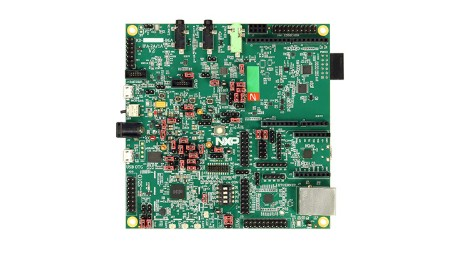
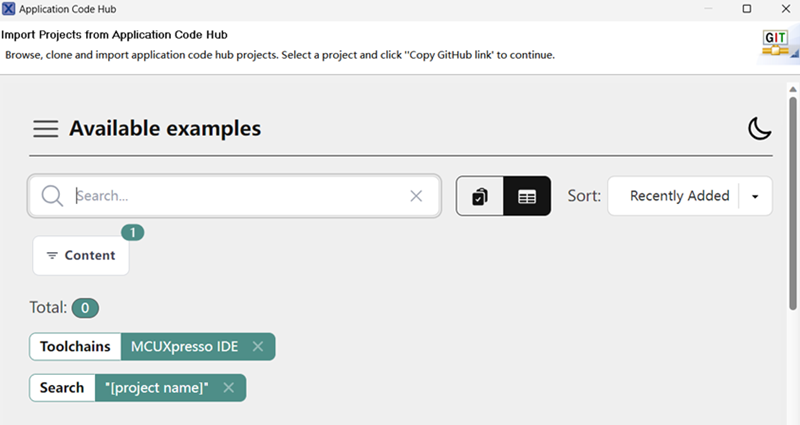
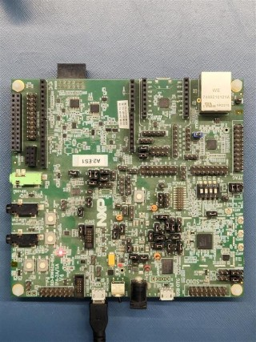
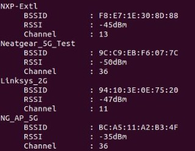
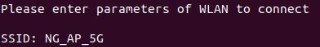
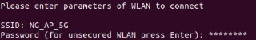
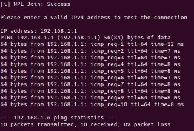

# NXP Application Code Hub

## WiFi setup on RW612BGA.
This is a demo example of Wi-Fi scan, connect and ping with nearby access point using RW612BGA.

#### Boards: RW612BGA
#### Categories: RTOS, Wireless Connectivity
#### Peripherals: SDIO
#### Toolchains: MCUXpresso IDE

## Table of Contents
1. [Software](#step1)
2. [Hardware](#step2)
3. [Setup](#step3)
4. [Results](#step4)
5. [FAQs](#step5) 
6. [Support](#step6)
7. [Release Notes](#step7)

## 1. Software
- [MCUXpresso 24.12.0 or newer.](https://nxp.com/mcuxpresso)
- [MCUXpresso for VScode 1.5.61 or newer](https://www.nxp.com/products/processors-and-microcontrollers/arm-microcontrollers/general-purpose-mcus/lpc800-arm-cortex-m0-plus-/mcuxpresso-for-visual-studio-code:MCUXPRESSO-VSC?cid=wechat_iot_303216)
- [SDK for RW612BGA.](https://mcuxpresso.nxp.com/en/select)

## 2. Hardware
- [RW612BGA](https://www.nxp.com/products/wireless-connectivity/wi-fi-plus-bluetooth-plus-802-15-4/wireless-mcu-with-integrated-tri-radio-1x1-wi-fi-6-plus-bluetooth-low-energy-5-4-802-15-4:RW612)

## 3. Setup

### 3.1 Step 1
1. Open MCUXpresso IDE, in the Quick Start Panel, choose Import from Application Code Hub   

2. Enter the demo name in the search bar.

3. Click Copy GitHub link, MCUXpresso IDE will automatically retrieve project attributes, then click Next>.

4. Select main branch and then click Next>, Select the MCUXpresso project, click Finish button to complete import.

### 3.2 Prepare demo
1. Connect a USB type micro B cable between the PC host and the USB port on the RW612BGA board.

2.  Open a serial terminal with the following settings:
    - 115200 baud rate
    - 8 data bits
    - No parity
    - One stop bit
    - No flow control

3.  Download the program to the target board.
4.  Either press the reset button on your board or launch the debugger in your IDE to begin running the demo.

### 3.4 Run Demo
1. The application will perform scan operation automatically and display the list of nearby access points.

2. Select and type the SSID available from the displayed list of APs.

3. After entering the SSID, enter the password. If SSID (ext. AP) is configured with open security, press enter to continue.

4. Wait for 5-7 seconds for successful connection with access point. Now enter the IP address of gateway or other device in the same network to perform ping operation.

## 5. FAQs
*Include FAQs here if appropriate. If there are none, then remove this section.*

## 6. Support
*Provide URLs for help here.*

*For training content you would usually refer the reader to the training workbook here.*

#### Project Metadata

<!----- Boards ----->

<!----- Categories ----->

<!----- Peripherals ----->

<!----- Toolchains ----->

Questions regarding the content/correctness of this example can be entered as Issues within this GitHub repository.

>**Warning**: For more general technical questions regarding NXP Microcontrollers and the difference in expected functionality, enter your questions on the [NXP Community Forum](https://community.nxp.com/)

## 7. Release Notes
| Version | Description / Update                           | Date                        |
|:-------:|------------------------------------------------|----------------------------:|
| 1.0     | Initial release on Application Code Hub        | May 15th 2025 |

<small> <b>Trademarks and Service Marks</b>: There are a number of proprietary logos, service marks, trademarks, slogans and product designations ("Marks") found on this Site. By making the Marks available on this Site, NXP is not granting you a license to use them in any fashion. Access to this Site does not confer upon you any license to the Marks under any of NXP or any third party's intellectual property rights. While NXP encourages others to link to our URL, no NXP trademark or service mark may be used as a hyperlink without NXP’s prior written permission. The following Marks are the property of NXP. This list is not comprehensive; the absence of a Mark from the list does not constitute a waiver of intellectual property rights established by NXP in a Mark. </small>  

<small> NXP, the NXP logo, NXP SECURE CONNECTIONS FOR A SMARTER WORLD, Airfast, Altivec, ByLink, CodeWarrior, ColdFire, ColdFire+, CoolFlux, CoolFlux DSP, DESFire, EdgeLock, EdgeScale, EdgeVerse, elQ, Embrace, Freescale, GreenChip, HITAG, ICODE and I-CODE, Immersiv3D, I2C-bus logo , JCOP, Kinetis, Layerscape, MagniV, Mantis, MCCI, MIFARE, MIFARE Classic, MIFARE FleX, MIFARE4Mobile, MIFARE Plus, MIFARE Ultralight, MiGLO, MOBILEGT, NTAG, PEG, Plus X, POR, PowerQUICC, Processor Expert, QorIQ, QorIQ Qonverge, RoadLink wordmark and logo, SafeAssure, SafeAssure logo , SmartLX, SmartMX, StarCore, Symphony, Tower, TriMedia, Trimension, UCODE, VortiQa, Vybrid are trademarks of NXP B.V. All other product or service names are the property of their respective owners. © 2021 NXP B.V. </small>
